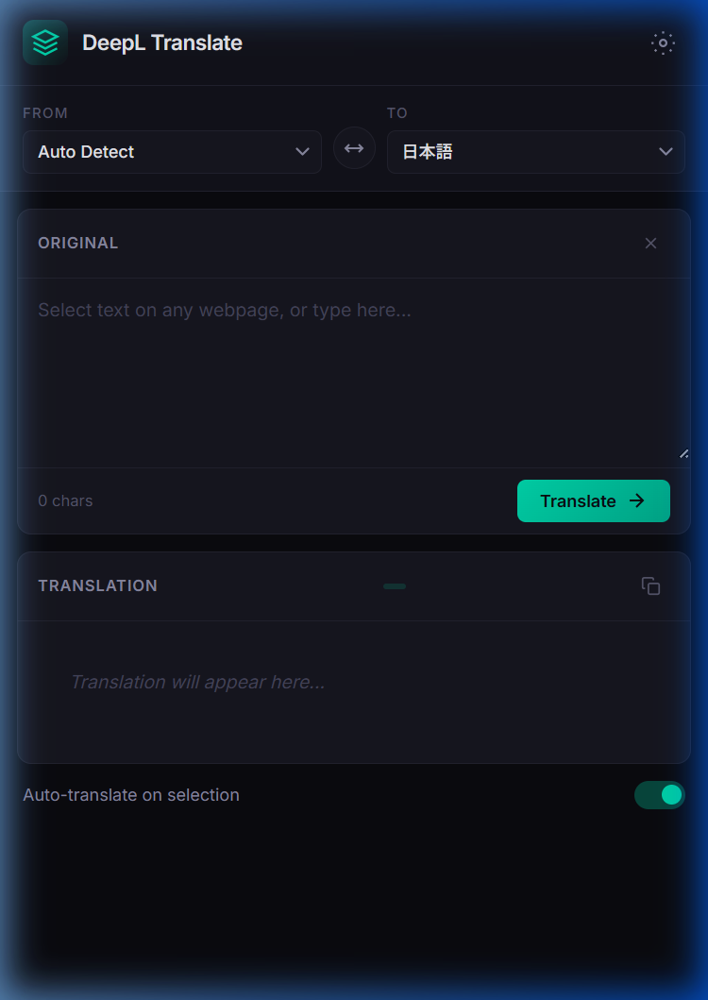

# DeepL Translate — Chrome Extension

A seamless Chrome sidebar translation extension powered by the DeepL API. Select text on any webpage and get instant translation in the side panel.



## Features

- 🔍 **Auto-translate on selection** — Select text on any webpage and it appears in the sidebar instantly
- 🌐 **13+ languages** — Japanese, English, German, French, Spanish, Chinese, Korean, and more
- 🔄 **Language swap** — Swap source/target languages with one click
- 📋 **Copy to clipboard** — Copy translation results instantly
- ⌨️ **Keyboard shortcut** — `Ctrl+Enter` to translate
- 💬 **Ask AI (scaffold)** — Chat-style panel to ask about selected text (stub response)
- ⚙️ **AI provider settings** — Register API key per provider and switch models dynamically
- 🔄 **Auto model discovery** — Models are fetched automatically from the selected provider
- 🧠 **Context-aware AI** — Uses full page content by default and prioritizes selected text when present
- 🧹 **Noise-reduced context** — Filters navigation/ads/footer-like content before sending page context to AI
- 🎨 **Dark theme UI** — Minimal black-based design for a distraction-free experience
- 🔑 **Free & Pro API support** — Works with DeepL's free and paid API plans

## Installation

### 1. Get a DeepL API Key

Sign up for a free account at [deepl.com/pro](https://www.deepl.com/pro#developer) and copy your API key.

### 2. Load the Extension

1. Open Chrome and go to `chrome://extensions`
2. Enable **Developer mode** (top right toggle)
3. Click **"Load unpacked"**
4. Select this folder (`chrome-translate-extension`)

### 3. Configure API Key

1. Click the extension icon in the toolbar — the sidebar opens
2. Click the ⚙️ settings icon
3. Enter your DeepL API key and select your plan (Free / Pro)
4. Click **Save**

### 4. Configure AI Provider

1. Open **Settings**
2. Select AI Provider (OpenAI / Anthropic / Gemini)
3. Enter API key for the selected provider
4. Model list is auto-fetched from provider (fallback list is used if fetch fails)
5. Choose model
6. Click **Save**

## Usage

1. Open the sidebar by clicking the extension icon
2. Browse any webpage and **select text** — it appears automatically in the Original field
3. Translation runs instantly (when Auto-translate is on)
4. Or type/paste text manually and press **Translate**

## File Structure

```text
chrome-translate-extension/
├── manifest.json      # Manifest V3 configuration
├── core/
│   └── background.js  # Service Worker — API calls & message routing
├── features/
│   ├── ai/
│   │   └── sidepanel/
│   │       └── ai-chat.js    # AI chat UI logic scaffold
│   └── translate/
│       ├── content.js # Content script — text selection detection
│       └── sidepanel/
│           ├── sidepanel.html # Side panel UI
│           ├── sidepanel.css  # Dark theme styles
│           └── sidepanel.js   # Side panel logic
└── icons/             # Extension icons (16/48/128px)
```

## Tech Stack

- **Manifest V3** Chrome Extension
- **Chrome Side Panel API** (`chrome.sidePanel`)
- **DeepL API** (Free: `api-free.deepl.com`, Pro: `api.deepl.com`)
- Vanilla HTML / CSS / JavaScript — zero dependencies

## Privacy

- Your API key is stored locally in `chrome.storage.local` (never sent anywhere except DeepL)
- Text is sent to DeepL's servers only for translation
- No analytics or tracking

## License

MIT
